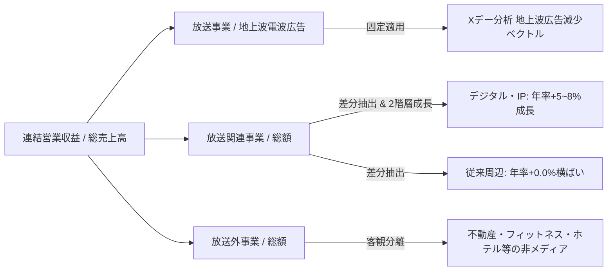

# Forecasting Methodology & Mathematical Modeling (推計ロジック・数理モデル詳細)

本シミュレーション（TV-Shift 2035）で採用されている「差分アプローチ（Differential Modeling Approach）」および「動的ベン図数理制御アルゴリズム」の技術仕様書です。

---

## 1. 差分アプローチ (Differential Modeling Approach)

日本の地上波民放局の決算書（有報）では、デジタル配信売上（TVer広告やHulu/FOD等のSVOD）が「放送関連事業」や「メディア・コンテンツ事業」の包括セグメントの中に混在（まぶされて）開示されています。

本モデルでは、**「すでに経営合意済みの地上波広告減少モデル（Xデー分析）」**の純粋なタイム・スポット数値を「放送事業（電波）」として確定させ、決算総額からの差分を抽出することで、デジタル配信およびIPビジネスの真の規模を浮き彫りにしています。

### 2階層成長率モデル (Two-Tier Growth Formulation)

予測期間（2027年3月期〜2035年3月期）における過大評価を防ぐため、保守的な2階層成長率を適用しています。

$$\text{放送関連売上}(t) = \text{デジタル売上}(t-1) \times (1 + g_{\text{digital}}) + \text{従来周辺売上}(t-1) \times (1 + 0.00)$$

* $g_{\text{digital}}$: 局別のデジタル成長率パラメータ（NTV: +8.0%, EX: +7.0%, TBS: +6.0%, TX: +8.0%, CX: +5.0%）

---

## 2. 動的ベン図制御アルゴリズム (Dynamic Venn Positioning Algorithm)

デザイン上の主観や推計による恣意的な配置を完全に排除し、100%決算・予測データの実数値比率から円の半径・中心座標・距離を幾何学的にリアルタイム計算しています。

### ① 円の半径 (Radius Calculation)
$$\text{Radius}(R) = \max\left(15, \sqrt{\text{売上高 (億円)}} \times \text{Scale}\right)$$

### ② 放送事業 ⇔ 放送関連事業 の水平重複度 (Horizontal Overlap)
デジタル配信の拡大に伴う「電波とネットの融合度」を水平距離に反映：
$$\text{デジタル融合度 } P_{\text{dig}} = \frac{\text{デジタル売上}}{\text{放送関連事業総額}}$$
$$\text{重複係数 } \text{Overlap}_{\text{BcRel}} = 0.08 + P_{\text{dig}} \times 0.36$$
$$\text{中心X座標} = 250 \mp (R_{\text{Bc}} + R_{\text{Rel}}) \times (0.5 - \text{Overlap}_{\text{BcRel}})$$

### ③ 放送外事業 の垂直距離・孤立度 (Vertical Separation)
メディアシナジーを持たない非放送事業（不動産・ホテル等）の比率が高いほど、オレンジの円が下方に孤立：
$$\text{非シナジー比率 } P_{\text{non\_synergy}} = \frac{\text{非シナジー売上}}{\text{放送外事業総額}}$$
$$\text{重複係数 } \text{Overlap}_{\text{RelNb}} = 0.28 - P_{\text{non\_synergy}} \times 0.25$$
$$\text{中心Y座標 (放送外)} = 135 + (\max(R_{\text{Bc}}, R_{\text{Rel}}) + R_{\text{Nb}}) \times (0.45 - \text{Overlap}_{\text{RelNb}})$$
