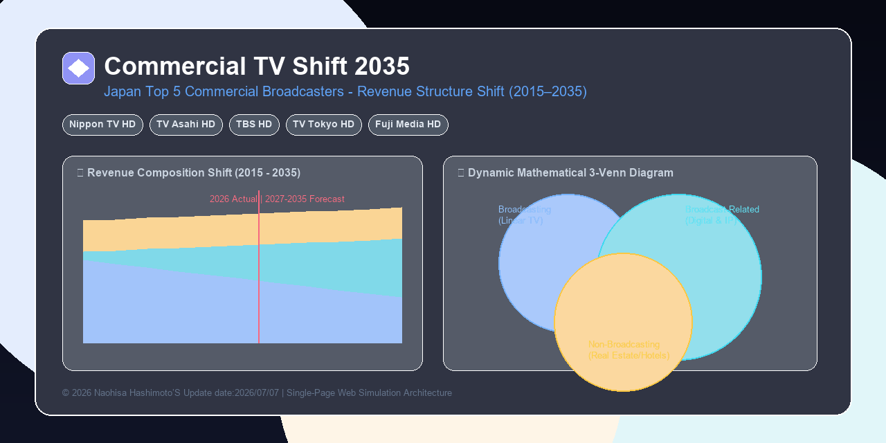

# Japan Commercial TV Shift 2035 (TV-Shift 2035)
### Revenue Structure Transformation Simulation of Japan's Top 5 Commercial Broadcasters (2015–2035)

[](https://opensource.org/licenses/MIT)
[](#)
[](#)
[](#)



An interactive financial intelligence simulation dashboard analyzing the long-term revenue transition, digital streaming growth (TVer/SVOD), global IP monetization, and non-broadcasting structures across Japan's Top 5 commercial television networks (Nippon TV HD, TV Asahi HD, TBS HD, TV Tokyo HD, and Fuji Media HD) from FY2015 to FY2035.

---

## 🌐 Live Dashboard

* **English Dashboard (Default)**: [https://naohisastry.github.io/japan-commercial-tv-shift-2035/](https://naohisastry.github.io/japan-commercial-tv-shift-2035/)
* **Japanese Dashboard (日本語版)**: [https://naohisastry.github.io/japan-commercial-tv-shift-2035/index_ja.html](https://naohisastry.github.io/japan-commercial-tv-shift-2035/index_ja.html)
  *(Also accessible via `/index_jp.html`)*

---

## 🔑 Keywords

Japan Commercial TV, Broadcasters, Terrestrial Linear TV, TVer, Streaming Wars, Hulu Japan, FOD, TELASA, U-NEXT, Paravi, Anime IP Licensing, Studio Ghibli, NARUTO, Non-Broadcasting, Real Estate Synergy, Differential Modeling, Financial Simulation, Market Intelligence, Chart.js, Dynamic Venn Diagram.

---

## 🍱 Key Features

### 1. Dynamic Mathematical Venn Diagram
* **X-Axis (Horizontal Digital Overlap)**: Driven dynamically by the broadcaster's digital streaming ratio (TVer/SVOD). As digital expansion progresses, the linear broadcasting (blue) and digital/IP (cyan) circles merge deeper together.
* **Y-Axis (Vertical Non-Media Separation)**: Driven by the proportion of pure non-media assets (real estate, hotels, fitness gyms). Broadcasters with high non-media exposure have their amber circle automatically pushed downward into an isolated position.
* **Common Scale Mode**: Normalizes individual broadcaster scales against the Top 5 Total base to visually compare absolute revenue sizes.

### 2. Interactive Time-Series Analytics
* **Revenue Composition by Segment (JPY Millions)**: Stacked area chart showing historical actuals (FY2015–FY2026) and econometric projections (FY2027–FY2035).
* **Revenue Share Transition (%)**: 100% stacked area chart illustrating structural business portfolio shifts over the 20-year horizon.

### 3. Broadcaster Strategic Insights & Alignment
* Comprehensive strategic breakdowns for each network (NTV's Hulu/Ghibli roadmap, TV Asahi's Ariake Dream Park ecosystem, TBS's U-NEXT synergy, TV Tokyo's anime-led expansion, and Fuji Media HD's digital transformation via Pony Canyon).

### 4. Detailed Numerical Data Grid
* Complete financial time-series table covering linear TV ad revenue, broadcast-related totals, digital breakdown, traditional peripheral revenue, non-broadcasting revenue, and consolidated totals.

### 5. Slide-Export Engine
* One-click download of publication-ready, white-background PNG Venn diagrams optimized for executive PowerPoint and Keynote presentation decks.

---

## 🛠 Repository Structure

This repository is built as a zero-dependency, self-contained single-page web application (SPA):

```text
├── index.html         # Main Dashboard Application (Self-Contained English SPA)
├── index_ja.html      # Japanese Dashboard Application (日本語版SPA本体)
├── README.md          # Project Documentation & Live Links
├── METHODOLOGY.md     # Differential Modeling & Mathematical Specifications
├── DATA_SOURCES.md    # Statutory Securities Reports (EDINET) & Lineage
├── CHANGELOG.md       # Version History
└── .gitignore         # Git Exclusion Rules
```

---

## 📚 Documentation & Evidence

* **[DATA_SOURCES.md](DATA_SOURCES.md)** — Statutory annual securities filings (EDINET), investor presentations, and segment decomposition rules.
* **[METHODOLOGY.md](METHODOLOGY.md)** — Differential modeling methodology, two-tier growth formulation, and dynamic Venn geometry algorithms.
* **[CHANGELOG.md](CHANGELOG.md)** — Version release log.

---

## 🚀 How to Run Locally

No web server installation or build steps are required.

1. Clone or download this repository.
2. Open **`index.html`** in any modern web browser (Chrome, Edge, Safari, Firefox) to launch the simulation instantly.

---

## 📝 Data Sources / データ出典

Financial data and disclosures are compiled from publicly available annual securities reports and investor relations materials.

## 📄 License / ライセンス

- **Code**（HTML / CSS / JavaScript）: [MIT License](LICENSE)
- **Content**（文章・図表・分析結果・整理済みデータ）: [CC BY 4.0](LICENSE-CONTENT.md)
- 出典表示例 / Attribution: Naohisa Hashimoto, "japan-commercial-tv-shift-2035", https://naohisastry.github.io/japan-commercial-tv-shift-2035/
- 第三者の元データの権利は各発行元に帰属します。 / Third-party source data remain the property of their original publishers.

© 2026 Naohisa Hashimoto
